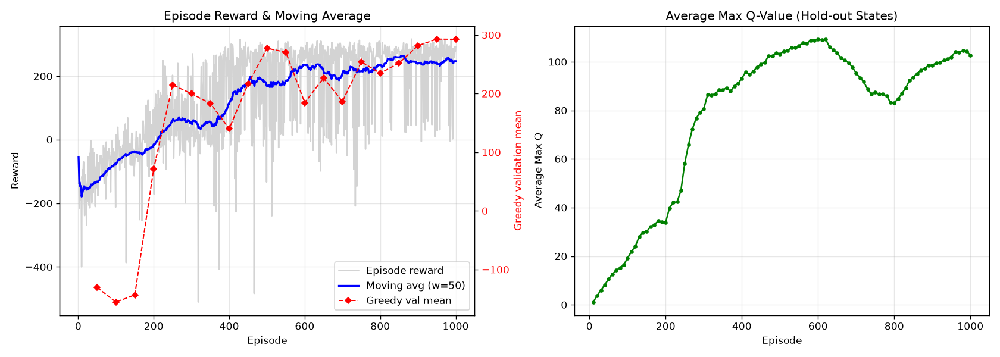

<div dir="rtl">

# گزارش نهایی پروژه ۴  
## فرودگر ماه با الگوریتم Deep Q-Network (DQN)

**درس:** هوش مصنوعی  
**نام اعضای گروه:** [نام اعضای گروه]  
**شماره‌های دانشجویی:** [شماره‌های دانشجویی]  
**نام استاد/دستیار آموزشی:** [تکمیل شود]  
**تاریخ:** [تکمیل شود]  

**مخزن پروژه:** [AIDGH/Lunar-Lander](https://github.com/AIDGH/Lunar-Lander)  
**شاخه تحویل:** `main`  
**شاخه حفظ‌شده آزمایش نهایی:** `final/double-dqn-buffer100k`

---

## چکیده

در این پروژه، یک عامل یادگیری تقویتی عمیق برای محیط `LunarLander-v2` پیاده‌سازی و آموزش داده شد. هدف عامل، کنترل یک فرودگر با چهار عمل گسسته—خاموش بودن موتورها، روشن‌کردن موتور اصلی، موتور جهت‌گیری چپ و موتور جهت‌گیری راست—به‌منظور فرود ایمن روی سکوی مشخص‌شده است.

الگوریتم به‌صورت کامل و بدون استفاده از کتابخانه‌های آماده یادگیری تقویتی پیاده‌سازی شد. اجزای اصلی شامل شبکه عصبی تخمین‌زننده مقادیر Q، حافظه بازپخش تجربه، سیاست اکتشاف `ε-Greedy`، شبکه هدف با به‌روزرسانی سخت و بهینه‌سازی مبتنی بر Backpropagation است. مدل نهایی از یک شبکه تمام‌متصل با دو لایه پنهان ۱۲۸ نورونی، ظرفیت Replay Buffer برابر `100,000` و ضریب تنزیل `0.99` استفاده می‌کند.

برای انتخاب تنظیم نهایی، دو آزمایش کنترل‌شده با Seed آموزش یکسان انجام شد: افزایش ظرفیت حافظه بازپخش به `100,000` و جایگزینی به‌روزرسانی سخت شبکه هدف با Soft Update. هر دو مدل روی ۱۵۰۰ Seed ارزیابی یکسان مقایسه شدند. نسخه Buffer-100k با میانگین پاداش `267.43` و نرخ موفقیت `95.07%` به‌طور معناداری بهتر از Soft Update با میانگین `222.09` و نرخ موفقیت `77.40%` بود. سپس مدل منتخب تنها یک بار روی Holdout نهایی شامل Seedهای `10000–10099` ارزیابی شد و میانگین پاداش `276.33` و نرخ موفقیت `97%` را به دست آورد.

---

## ۱. تعریف مسئله

محیط Lunar Lander یک مسئله کنترل ترتیبی است. در هر گام زمانی، عامل یک بردار وضعیت هشت‌بعدی دریافت می‌کند:

1. موقعیت افقی `x`
2. موقعیت عمودی `y`
3. سرعت افقی `vx`
4. سرعت عمودی `vy`
5. زاویه فرودگر
6. سرعت زاویه‌ای
7. تماس پایه چپ با زمین
8. تماس پایه راست با زمین

عامل باید یکی از چهار عمل زیر را انتخاب کند:

| شماره عمل | عمل |
|---:|---|
| 0 | خاموش بودن موتورها (`no_op`) |
| 1 | موتور جهت‌گیری چپ |
| 2 | موتور اصلی |
| 3 | موتور جهت‌گیری راست |

هدف، بیشینه‌کردن مجموع پاداش بلندمدت است. فرود نرم و پایدار پاداش مثبت ایجاد می‌کند، درحالی‌که برخورد شدید، خروج از محدوده مناسب، مصرف نامناسب سوخت یا رفتارهای طولانی و ناپایدار موجب کاهش پاداش می‌شوند. در ارزیابی‌های این پروژه، اپیزودی با پاداش حداقل `200` به‌عنوان موفق یا **Solved** در نظر گرفته شده است.

---

## ۲. انطباق پیاده‌سازی با صورت پروژه

اجزای اصلی خواسته‌شده در پروژه در پیاده‌سازی نهایی وجود دارند:

| الزام | فایل/پیاده‌سازی | وضعیت |
|---|---|---|
| معماری شبکه عصبی | `model.py` | انجام‌شده |
| Agent و Replay Buffer | `agent.py` | انجام‌شده |
| سیاست `ε-Greedy` | `agent.py` | انجام‌شده |
| Backpropagation | `agent.py` | انجام‌شده |
| Policy Network و Target Network | یک کلاس `DQN` که دو بار نمونه‌سازی می‌شود | انجام‌شده |
| حلقه آموزش مستقیم | `train.py` | انجام‌شده |
| ذخیره بهترین وزن | `weights.pth` بر اساس Validation | انجام‌شده |
| ارزیابی وزن ذخیره‌شده | `test.py` | انجام‌شده |
| نمودار Reward و Moving Average | `training_plot.png` | انجام‌شده |
| جدول Hyperparameterها | همین گزارش | انجام‌شده |
| پاسخ چهار سؤال مفهومی | بخش ۱۵ | انجام‌شده |
| پیاده‌سازی بدون StableBaselines/RLlib | PyTorch، NumPy و Gymnasium | انجام‌شده |

### یادداشت فنی درباره نام‌گذاری الگوریتم

در نام برخی Branchها، Artifactها و فیلدهای متادیتا عبارت `double_dqn` باقی مانده است؛ بااین‌حال، فرمول Target در کد به شکل زیر است:

```text
target_q = reward + gamma * (1 - done) * max_a Q_target(next_state, a)
```

انتخاب و ارزیابی عمل بعدی هر دو توسط Target Network انجام می‌شود؛ بنابراین پیاده‌سازی از نظر فنی **DQN استاندارد با Target Network** است، نه Double DQN کلاسیک. ازآنجاکه صورت پروژه نیز DQN را خواسته است، در این گزارش نام دقیق **DQN** استفاده می‌شود.

---

## ۳. ساختار فایل‌ها

فایل‌های اصلی پیاده‌سازی عبارت‌اند از:

| فایل | مسئولیت |
|---|---|
| `model.py` | تعریف معماری شبکه تخمین‌زننده Q |
| `agent.py` | Agent، Replay Buffer، انتخاب عمل، یادگیری و Target Update |
| `train.py` | اجرای آموزش، Validation، ذخیره وزن و تولید نمودار |
| `test.py` | بارگذاری وزن و ارزیابی Greedy |
| `weights.pth` | وزن بهترین Checkpoint |
| `training_metrics.json` | داده‌های کامل آموزش و Validation |
| `training_plot.png` | نمودار پاداش، Moving Average و Average Max Q |
| `artifacts/final-double-dqn-buffer100k/` | Benchmarkها، Holdout و شواهد انتخاب مدل |

فایل `game.py` فقط Wrapper محیط Gymnasium است و منطق عامل در آن قرار نگرفته است.

---

## ۴. مسیر آزمایش‌ها و مدیریت Runها

فرآیند توسعه فقط شامل یک آموزش نهایی نبود و در چند مرحله انجام شد:

1. **پیاده‌سازی پایه DQN:**  
   معماری شبکه، Replay Buffer، سیاست `ε-Greedy` و Hard Target Update پیاده‌سازی و
   صحت اجرای آموزش و تست بررسی شد.

2. **Runهای اکتشافی اولیه:**  
   چند اجرای مقدماتی با تنظیمات و Seedهای متفاوت برای پیدا کردن مشکلاتی مانند
   ناپایداری Q-Value، افت پاداش و استفاده طولانی از موتورهای جانبی انجام شد.
   اجراهای قدیمی با Seedهای `61` و `73` و شاخه‌های ترکیبی، به دلیل یکسان نبودن
   پروتکل یا ناقص بودن Artifactها، در مقایسه رسمی نهایی استفاده نشدند.

3. **Ablation کنترل‌شده با Training Seed برابر 42:**  
   دو تغییر به‌صورت مستقل بررسی شدند:
   - افزایش ظرفیت Replay Buffer به `100000`
   - استفاده از Soft Target Update با `tau = 0.005`

4. **ارزیابی روی Seedهای یکسان:**  
   هر دو مدل روی Benchmark A با ۵۰۰ اپیزود و Benchmark B با ۱۰۰۰ اپیزود ارزیابی
   شدند. ترتیب Seedها برای هر دو مدل دقیقاً یکسان بود؛ بنابراین مقایسه علاوه بر
   آمار تجمیعی، به‌صورت جفت‌شده Seed به Seed نیز انجام شد.

5. **انتخاب مدل و Holdout نهایی:**  
   مدل Buffer-100k پیش از مشاهده Holdout انتخاب شد. سپس فقط همان مدل روی
   Seedهای `10000` تا `10099` اجرا شد.

Artifactهای اصلی شامل وزن‌ها، `training_metrics.json`، نمودار آموزش،
Benchmarkهای بزرگ، گزارش مقایسه و Holdout نهایی در شاخه نهایی پروژه نگهداری
شدند. پوشه محلی `runs/` بخشی از ZIP تحویل نیست و صرفاً برای مدیریت آزمایش‌ها
استفاده شده است.

---

## ۵. الگوریتم DQN

در Q-Learning هدف، تقریب تابع بهینه زیر است:

```text
Q*(s, a) = max over policies of the expected discounted future return
          after choosing action a in state s
```

ازآنجاکه فضای وضعیت Lunar Lander پیوسته است، نگهداری یک جدول Q عملی نیست. به همین دلیل یک شبکه عصبی پارامتری با وزن‌های `theta` برای تقریب `Q(state, action; theta)` استفاده می‌شود.

برای هر Transition ذخیره‌شده به شکل

```text
(state, action, reward, next_state, done)
```

Target یادگیری به صورت زیر محاسبه می‌شود:

```text
if done:
    target_q = reward
else:
    target_q = reward + gamma * max_a Q_target(next_state, a)
```

خروجی متناظر با عمل انتخاب‌شده از Policy Network برابر است با:

```text
predicted_q = Q_policy(state, selected_action)
```

سپس اختلاف `predicted_q` و `target_q` با Huber Loss یا `Smooth L1 Loss` کمینه می‌شود:

```text
loss = SmoothL1Loss(predicted_q, target_q)
```

برای کاهش احتمال انفجار گرادیان، Norm گرادیان‌ها حداکثر روی `1.0` Clip می‌شود.

---

## ۶. معماری شبکه عصبی

معماری نهایی یک Multi-Layer Perceptron تمام‌متصل است:

```text
8 inputs -> 128 neurons -> 128 neurons -> 4 Q-values
```

| لایه | ورودی | خروجی | فعال‌ساز |
|---|---:|---:|---|
| Fully Connected 1 | 8 | 128 | ReLU |
| Fully Connected 2 | 128 | 128 | ReLU |
| Output Layer | 128 | 4 | Linear |

تعداد کل پارامترهای قابل‌آموزش شبکه:

```text
(8 * 128 + 128) + (128 * 128 + 128) + (128 * 4 + 4) = 18,180
```

### دلیل انتخاب ReLU

تابع ReLU به شکل

```text
ReLU(x) = max(0, x)
```

محاسبه ساده‌ای دارد و نسبت به توابع Sigmoid و Tanh در شبکه‌های عمیق کمتر با مشکل محوشدن گرادیان مواجه می‌شود. دو لایه ۱۲۸ نورونی نیز ظرفیت کافی برای یادگیری روابط غیرخطی میان موقعیت، سرعت، زاویه و انتخاب موتور فراهم می‌کنند، بدون آنکه شبکه بیش‌ازحد بزرگ و آموزش آن پرهزینه شود.

### چرا لایه خروجی Linear است؟

چهار خروجی شبکه نشان‌دهنده مقدار Q هر عمل هستند. Q-Value یک احتمال محدود به بازه مشخص نیست و می‌تواند مثبت یا منفی باشد؛ بنابراین استفاده از Softmax، Sigmoid یا ReLU در لایه خروجی مناسب نیست. لایه Linear امکان تولید هر مقدار حقیقی را فراهم می‌کند.

---

## ۷. حافظه بازپخش تجربه

Replay Buffer به‌صورت یک حافظه حلقوی پیاده‌سازی شده است. هر تجربه شامل وضعیت، عمل، پاداش، وضعیت بعدی و پرچم پایان اپیزود است. در صورت پرشدن حافظه، تجربه‌های قدیمی به‌ترتیب بازنویسی می‌شوند.

در هر گام، پس از ذخیره تجربه، در صورتی که تعداد نمونه‌ها حداقل برابر Batch Size باشد، یک Mini-batch تصادفی با اندازه `64` انتخاب می‌شود. انتخاب تصادفی نمونه‌ها همبستگی شدید میان داده‌های متوالی را کاهش می‌دهد.

ظرفیت نسخه نهایی:

```text
Replay Buffer Capacity = 100,000 transitions
```

افزایش ظرفیت بافر باعث شد تجربه‌های متنوع‌تری از مراحل ابتدایی، میانی و انتهایی اپیزودها برای مدت بیشتری حفظ شوند و توزیع Mini-batchها کمتر تحت تأثیر رفتارهای بسیار اخیر عامل قرار گیرد.

---

## ۸. سیاست اکتشاف و بهره‌برداری

انتخاب عمل در زمان آموزش با سیاست `ε-Greedy` انجام می‌شود:

```text
with probability epsilon:
    action = random action
otherwise:
    action = argmax_a Q_policy(state, a)
```

مقدار Epsilon از `1.0` آغاز می‌شود و در پایان هر اپیزود کاهش می‌یابد:

```text
epsilon = max(0.01, 0.995 * epsilon)
```

کاهش Epsilon در سطح اپیزود انجام می‌شود، نه پس از هر Gradient Step. این تصمیم باعث می‌شود اکتشاف در چند اپیزود نخست به‌سرعت از بین نرود. مقدار Epsilon در پایان آموزش به حداقل `0.01` رسیده است.

در Validation و Test مقدار Epsilon برابر صفر است؛ در نتیجه سیاست کاملاً Greedy و تکرارپذیر است.

---

## ۹. شبکه هدف و پایداری آموزش

در Agent دو شبکه هم‌ساختار وجود دارد:

- `policy_net`: شبکه‌ای که با Backpropagation به‌روزرسانی می‌شود.
- `target_net`: شبکه‌ای که برای محاسبه Targetهای Bellman استفاده می‌شود.

در ابتدای آموزش وزن‌های Policy Network در Target Network کپی می‌شوند. پس از همگام‌سازی اولیه، کد با شمارنده `steps_done` شبکه هدف را به‌صورت دوره‌ای همگام می‌کند. شرط برنامه `steps_done % 1000 == 0` است؛ بنابراین یک همگام‌سازی در نخستین فراخوانی یادگیری و سپس در فاصله‌های هزار فراخوانی انجام می‌شود:

```text
target_network_weights = policy_network_weights
```

در فاصله دو انتقال، Target Network ثابت می‌ماند. این جداسازی از تغییر هم‌زمان مقدار پیش‌بینی‌شده و Target جلوگیری کرده و آموزش را پایدارتر می‌کند.

---

## ۱۰. تنظیمات و Hyperparameterها

| پارامتر | مقدار نهایی | توضیح |
|---|---:|---|
| الگوریتم | DQN | Replay Buffer + Hard Target Network |
| تعداد اپیزود آموزش | 1000 | حلقه اصلی آموزش |
| Training Seed | 42 | تکرارپذیری آموزش |
| ابعاد ورودی | 8 | مؤلفه‌های وضعیت |
| تعداد عمل | 4 | چهار فرمان موتور |
| لایه‌های پنهان | 128، 128 | Fully Connected |
| تابع فعال‌ساز | ReLU | پس از دو لایه پنهان |
| تابع خروجی | Linear | چهار Q-Value |
| Optimizer | Adam | بهینه‌سازی Policy Network |
| Learning Rate | `1e-3` | نرخ یادگیری |
| Discount Factor (`γ`) | `0.99` | اهمیت پاداش آینده |
| Batch Size | `64` | اندازه Mini-batch |
| Replay Buffer Capacity | `100000` | ظرفیت حافظه تجربه |
| Epsilon Start | `1.0` | اکتشاف کامل در شروع |
| Epsilon End | `0.01` | حداقل اکتشاف |
| Epsilon Decay | `0.995` | کاهش در پایان هر اپیزود |
| Target Update | Hard | انتقال کامل وزن‌ها |
| Target Update Frequency | `1000` | بر حسب Learning Step |
| Loss Function | Smooth L1 | Huber Loss |
| Gradient Clip Norm | `1.0` | کنترل Gradientهای بزرگ |
| Moving Average Window | `50` | تحلیل روند آموزش |
| Q Evaluation Interval | `10` اپیزود | Average Max Q |
| Validation Interval | `50` اپیزود | انتخاب Checkpoint |
| Validation Episodes | `10` | ارزیابی Greedy |
| Validation Seeds | `901–910` | جدا از Test |
| Solved Threshold | `200` | معیار موفقیت |

---

## ۱۱. فرآیند آموزش و انتخاب Checkpoint

در هر اپیزود مراحل زیر اجرا می‌شود:

1. محیط Reset می‌شود.
2. Agent با سیاست `ε-Greedy` عمل را انتخاب می‌کند.
3. محیط `next_state`، `reward` و `done` را برمی‌گرداند.
4. Transition در Replay Buffer ذخیره می‌شود.
5. یک Mini-batch تصادفی نمونه‌گیری شده و Policy Network به‌روزرسانی می‌شود.
6. در صورت رسیدن شمارنده یادگیری به مضرب `1000`، Target Network به‌روزرسانی می‌شود.
7. پس از پایان اپیزود، Epsilon کاهش می‌یابد.
8. هر ۵۰ اپیزود، ده اپیزود Validation کاملاً Greedy روی Seedهای `901–910` اجرا می‌شود.
9. در صورت بهبود میانگین Validation، وزن‌ها در `weights.pth` ذخیره می‌شوند.

این روش سبب می‌شود وزن نهایی بر اساس کیفیت سیاست در حالت Deployment انتخاب شود، نه صرفاً پاداش آموزش که شامل نویز ناشی از اکتشاف است.

---

## ۱۲. نمودار و تحلیل روند آموزش

> برای نمایش صحیح شکل در نسخه PDF، فایل `Report.md` باید هنگام تبدیل در کنار `training_plot.png` قرار داشته باشد.



**شکل ۱ —** سمت چپ: پاداش هر اپیزود، Moving Average با پنجره ۵۰ و میانگین Validation. سمت راست: Average Max Q روی مجموعه‌ای ثابت از وضعیت‌های پایش Q. این مجموعه فقط برای رسم شاخص Average Max Q است و با Holdout نهایی ارزیابی تفاوت دارد.

خلاصه آماری آموزش نهایی:

| معیار | مقدار |
|---|---:|
| میانگین پاداش تمام اپیزودهای آموزش | `148.13` |
| واریانس پاداش آموزش | `21696.20` |
| Moving Average نهایی با پنجره ۵۰ | `207.84` |
| Epsilon نهایی | `0.01` |
| بهترین میانگین Validation | `296.73` |
| اپیزود بهترین Checkpoint | `1000` |
| نرخ موفقیت Validation در Checkpoint نهایی | `100%` |

### تحلیل مراحل یادگیری

در ابتدای آموزش، شبکه هنوز تخمین مناسبی از ارزش عمل‌ها ندارد و Epsilon نیز نزدیک به یک است؛ بنابراین رفتار تقریباً تصادفی و پاداش‌ها غالباً منفی هستند. میانگین Validation در اپیزودهای ۵۰، ۱۰۰ و ۱۵۰ به‌ترتیب حدود `-130.63`، `-138.95` و `-107.63` بود.

در حوالی اپیزود ۲۰۰ نخستین جهش جدی رخ داد و میانگین Validation به `194.71` با نرخ موفقیت `70%` رسید. در اپیزود ۳۰۰ میانگین `242.28` و نرخ موفقیت `90%` ثبت شد. این تغییر نشان می‌دهد عامل توانسته رابطه میان سرعت عمودی، زاویه و استفاده از موتور اصلی را یاد بگیرد.

بااین‌حال روند آموزش یکنواخت نیست. برای نمونه در اپیزود ۳۵۰ میانگین Validation به `0.61` کاهش یافت، اما در اپیزود ۴۰۰ دوباره به `264.84` رسید. افت‌های مشابه در اپیزودهای ۵۵۰، ۷۰۰، ۸۰۰ و ۸۵۰ مشاهده شدند. دلایل اصلی این نوسان‌ها عبارت‌اند از:

- ادامه اکتشاف و ورود Transitionهای ناموفق به Replay Buffer؛
- ماهیت Bootstrap در Q-Learning و وابستگی Target به تخمین شبکه؛
- Hard Updateهای دوره‌ای Target Network که می‌توانند توزیع Targetها را تغییر دهند؛
- تصادفی‌بودن شرایط اولیه محیط؛
- کوچک‌بودن مجموعه Validation ده‌اپیزودی که به چند شکست حساس است.

در مراحل پایانی، پایداری بهتر شد. Validation در اپیزود ۹۰۰ برابر `292.30`، در اپیزود ۹۵۰ برابر `295.13` و در اپیزود ۱۰۰۰ برابر `296.73` بود و هر سه ارزیابی نرخ موفقیت `100%` داشتند.

Moving Average آموزش در پایان `207.84` است که از آستانه حل‌شدن `200` عبور می‌کند. این مقدار از Validation و Test کمتر است، زیرا در آموزش Epsilon صفر نیست و عامل همچنان با احتمال یک درصد عمل تصادفی انجام می‌دهد.

Average Max Q نیز از مقادیر نزدیک صفر و منفی در ابتدای آموزش به حدود `107.75` در انتها رسیده است. رشد تدریجی این معیار نشان می‌دهد شبکه با مشاهده تجربه‌های موفق، بازده بلندمدت بیشتری برای وضعیت‌های Hold-out تخمین زده است. بااین‌حال Average Max Q به‌تنهایی معیار عملکرد نیست و باید همراه با Reward و نرخ موفقیت تفسیر شود.

---

## ۱۳. آزمایش‌های کنترل‌شده و انتخاب مدل نهایی

### ۱۳.۱. طراحی آزمایش

برای جلوگیری از نسبت‌دادن نتیجه به چند تغییر هم‌زمان، دو Ablation مستقل اجرا شد:

1. **Buffer 100k Only**
   - Replay Buffer: `10000 → 100000`
   - Target Update: Hard با فاصله `1000`
   - سایر اجزای الگوریتم ثابت

2. **Soft Update Only**
   - Replay Buffer: `10000`
   - Target Update: Soft با `τ=0.005`
   - سایر اجزای الگوریتم ثابت

هر دو مدل با Training Seed برابر `42` آموزش داده شدند. مدل‌ها روی Seedهای ارزیابی کاملاً یکسان بررسی شدند:

| Benchmark | تعداد اپیزود | Seedها |
|---|---:|---|
| A | 500 | `1234–1733` |
| B | 1000 | `5000–5999` |
| مجموع | 1500 | دو بازه فوق |

Holdout نهایی `10000–10099` تا پایان انتخاب مدل دست‌نخورده باقی ماند.

### ۱۳.۲. نتیجه مقایسه

| معیار | Buffer 100k | Soft Update |
|---|---:|---:|
| میانگین Benchmark A | **267.81** | 220.03 |
| نرخ موفقیت Benchmark A | **94.60%** | 76.40% |
| میانگین Benchmark B | **267.24** | 223.12 |
| نرخ موفقیت Benchmark B | **95.30%** | 77.90% |
| میانگین ترکیبی | **267.43** | 222.09 |
| Median ترکیبی | **279.79** | 245.61 |
| انحراف معیار ترکیبی | **62.74** | 87.93 |
| نرخ موفقیت ترکیبی | **95.07%** | 77.40% |
| نرخ امتیاز منفی | **2.67%** | 3.33% |
| میانگین طول اپیزود | **213.81** | 411.31 |
| بهترین Validation | **296.73** | 269.40 |

در مقایسه جفت‌شده Seed به Seed:

- Buffer-100k در `1222` مورد از `1500` اپیزود پاداش بیشتری داشت.
- Soft Update تنها در `278` مورد بهتر بود.
- اختلاف میانگین `Soft - Buffer` برابر `-45.34` بود.
- بازه اطمینان Bootstrap نودوپنج درصد برابر `[-51.25, -39.54]` بود.
- نرخ موفقیت Soft Update نسبت به Buffer-100k حدود `17.67` واحد درصد کمتر بود.
- انحراف معیار Soft Update حدود `25.20` واحد بیشتر بود.

ازآنجاکه کل بازه اطمینان اختلاف میانگین در ناحیه منفی قرار دارد، برتری Buffer-100k فقط ناشی از نویز نمونه‌گیری نیست. همچنین طول اپیزود کمتر نشان می‌دهد سیاست منتخب سریع‌تر به فرود یا پایان پایدار می‌رسد و کمتر دچار Hover طولانی می‌شود.

### ۱۳.۳. علت انتخاب Buffer-100k

Buffer بزرگ‌تر باعث حفظ تنوع بیشتر تجربه‌ها شد. در مقابل، Soft Update با وجود میانگین مناسب، رفتارهای طولانی‌تر و Streakهای غیرعادی موتورهای جانبی ایجاد کرد. در Benchmarkهای Soft Update، طولانی‌ترین Streak موتور چپ به `468` و `293` رسید؛ درحالی‌که مقادیر متناظر مدل نهایی بسیار محدودتر بودند. بنابراین Buffer-100k هم از نظر Reward و هم از نظر Reliability و کارایی زمانی انتخاب بهتری بود.

---

## ۱۴. ارزیابی نهایی Holdout

پس از انتخاب مدل و بدون استفاده از Seedهای Holdout در آموزش، Validation یا انتخاب تنظیمات، مدل Buffer-100k روی صد اپیزود با Seedهای `10000–10099` ارزیابی شد.

| معیار | نتیجه Holdout |
|---|---:|
| تعداد اپیزود | 100 |
| میانگین پاداش | **276.33** |
| Median پاداش | **282.50** |
| انحراف معیار | **48.31** |
| کمینه پاداش | `11.97` |
| بیشینه پاداش | `325.31` |
| اپیزود موفق | **97/100** |
| نرخ موفقیت | **97.00%** |
| امتیاز منفی | **0/100** |
| میانگین طول اپیزود | `204.55` |

توزیع عمل‌ها در Holdout:

| عمل | درصد کل Stepها |
|---|---:|
| خاموش بودن موتورها | 36.72% |
| موتور جهت‌گیری چپ | 11.69% |
| موتور اصلی | 39.69% |
| موتور جهت‌گیری راست | 11.89% |

استفاده تقریباً متقارن از موتورهای چپ و راست نشان می‌دهد سیاست نهایی سوگیری جهت‌گیری شدید ندارد. موتور اصلی بیشترین سهم را دارد که با نیاز به کنترل سرعت عمودی سازگار است. طولانی‌ترین Streak موتور چپ `27` و موتور راست `46` بود که نسبت به نسخه Soft Update کنترل‌شده‌تر است.

Holdout از Benchmarkهای انتخاب مدل نیز بهتر بود: میانگین از `267.43` به `276.33` و نرخ موفقیت از `95.07%` به `97%` رسید. این نتیجه نشان می‌دهد مدل روی داده‌های انتخاب‌نشده نیز تعمیم مناسبی دارد.

---

## ۱۵. پاسخ به سؤالات مفهومی

### سؤال ۱: چرا از Experience Replay استفاده می‌کنیم؟

Transitionهای یک اپیزود به‌شدت به یکدیگر وابسته‌اند. برای مثال، چند وضعیت متوالی هنگام سقوط تقریباً موقعیت، سرعت و زاویه مشابهی دارند. اگر شبکه مستقیماً با همین ترتیب زمانی آموزش ببیند، فرض تقریباً مستقل و هم‌توزیع بودن نمونه‌ها نقض می‌شود.

پیامدهای آموزش مستقیم روی داده‌های متوالی عبارت‌اند از:

- گرادیان‌های متوالی در جهت‌های بسیار مشابه حرکت می‌کنند؛
- شبکه ممکن است رفتارهای بسیار اخیر را بیش‌ازحد یاد بگیرد و تجربه‌های قبلی را فراموش کند؛
- نوسان و واگرایی افزایش می‌یابد؛
- یک تجربه ناموفق طولانی می‌تواند چندین Update متوالی را تحت تأثیر قرار دهد.

Replay Buffer تجربه‌ها را در حافظه ذخیره کرده و Mini-batchها را به‌صورت تصادفی انتخاب می‌کند. این کار همبستگی زمانی را کاهش می‌دهد، توزیع داده آموزش را متنوع‌تر می‌کند و امکان استفاده چندباره از تجربه‌های ارزشمند را فراهم می‌سازد. همچنین بازده نمونه‌ای افزایش می‌یابد، زیرا هر Transition می‌تواند در چند Update مختلف استفاده شود.

در مدل نهایی، ظرفیت `100000` نسبت به `10000` بهتر عمل کرد. دلیل محتمل این است که نمونه‌های موفق و ناموفق از دامنه وسیع‌تری از مراحل آموزش هم‌زمان در حافظه حضور داشتند و شبکه کمتر به توزیع کوتاه‌مدت رفتار اخیر وابسته شد.

---

### سؤال ۲: چرا Policy Network و Target Network جدا هستند؟

در Q-Learning، Target شامل تخمین Q وضعیت بعدی است:

```text
target_q = reward + gamma * max_a Q(next_state, a)
```

اگر همان شبکه‌ای که `Q(state, action)` را پیش‌بینی می‌کند هم‌زمان Target را نیز تولید کند، پس از هر Update هم خروجی مورد یادگیری و هم مقدار هدف تغییر می‌کنند. این وضعیت **Moving Target** نام دارد.

برای درک شهودی، فرض کنید شبکه تلاش می‌کند به نقطه‌ای برسد، اما همان نقطه پس از هر قدم جابه‌جا می‌شود. نتیجه می‌تواند نوسان، Overestimation یا حتی واگرایی باشد.

راه‌حل DQN استفاده از دو شبکه است:

- Policy Network در هر Gradient Step تغییر می‌کند.
- Target Network برای مدتی ثابت می‌ماند.
- هر چند مرحله، وزن Policy در Target کپی می‌شود.

در پروژه حاضر فاصله تنظیم‌شده برای این انتقال `1000` فراخوانی یادگیری است. ثابت‌ماندن Target Network در فاصله دو Update باعث می‌شود مسئله رگرسیون در بازه‌های کوتاه Target نسبتاً ثابتی داشته باشد و آموزش پایدارتر شود.

---

### سؤال ۳: نقش Epsilon Decay در Exploration و Exploitation چیست؟

در ابتدای آموزش شبکه هیچ دانشی ندارد. اگر عامل از همان ابتدا همیشه عمل دارای بیشترین Q را انتخاب کند، انتخاب‌ها بر اساس تخمین‌های تصادفی اولیه خواهند بود و ممکن است عامل هرگز سیاست‌های بهتر را کشف نکند. بنابراین Epsilon در شروع برابر `1.0` است تا عامل محیط را گسترده‌تر جست‌وجو کند.

با افزایش تجربه، Epsilon به‌تدریج کاهش می‌یابد تا عامل بیشتر از دانشی که آموخته است استفاده کند. در این پروژه:

```text
epsilon_t = max(0.01, 1.0 * 0.995^t)
```

اگر Decay بیش‌ازحد سریع باشد:

- عامل خیلی زود به یک سیاست ناقص متعهد می‌شود؛
- احتمال کشف مسیرهای بهتر فرود کاهش می‌یابد؛
- ممکن است یک رفتار نامناسب مانند روشن‌کردن تکراری یک موتور تثبیت شود؛
- Replay Buffer تنوع کمتری خواهد داشت.

اگر Decay بیش‌ازحد کند باشد:

- حتی پس از یادگیری، اعمال تصادفی زیاد باقی می‌مانند؛
- فرودهای خوب با فرمان‌های تصادفی خراب می‌شوند؛
- پاداش آموزش نوسان زیادی دارد؛
- رسیدن به رفتار پایدار طولانی‌تر می‌شود.

Decay برابر `0.995` در سطح اپیزود، یک تعادل میان اکتشاف اولیه و بهره‌برداری نهایی ایجاد کرد. مقدار حداقل `0.01` نیز مقدار کمی اکتشاف را تا پایان آموزش حفظ می‌کند.

---

### سؤال ۴: خروجی شبکه چه مفهومی دارد؟

لایه خروجی چهار عدد تولید می‌کند:

```text
[Q(state, action_0), Q(state, action_1),
 Q(state, action_2), Q(state, action_3)]
```

هر مقدار Q تخمین بازده تنزیل‌شده مورد انتظار در صورت انتخاب آن عمل در وضعیت فعلی و ادامه‌دادن سیاست پس از آن است:

```text
Q(state, action) =
expected(reward_1 + gamma * reward_2 + gamma^2 * reward_3 + ...)
```

این خروجی‌ها احتمال نیستند و مجموع آن‌ها لازم نیست یک باشد. در زمان Test، عملی انتخاب می‌شود که بیشترین Q-Value را دارد.

اگر فرودگر در ارتفاع زیاد با سرعت عمودی منفی بزرگی در حال سقوط باشد، منطقاً انتظار می‌رود Q-Value موتور اصلی از سایر اعمال بیشتر شود؛ زیرا روشن‌کردن موتور اصلی سرعت سقوط را کم کرده و احتمال برخورد شدید را کاهش می‌دهد. در چنین وضعیتی:

```text
Q(state, main_engine) > Q(state, no_op)
```

انتظار می‌رود. بااین‌حال اگر زاویه فرودگر شدیداً نامناسب باشد، ممکن است شبکه ابتدا یکی از موتورهای جهت‌گیری را با Q بالاتر انتخاب کند تا وضعیت زاویه‌ای اصلاح شود و سپس موتور اصلی را فعال کند. بنابراین انتخاب موتور اصلی نه یک قانون دستی، بلکه نتیجه ارزیابی هم‌زمان تمام مؤلفه‌های وضعیت است.

---

## ۱۶. نقاط قوت، محدودیت‌ها و تهدیدهای اعتبار

### نقاط قوت

- پیاده‌سازی کامل DQN بدون کتابخانه آماده RL؛
- جداسازی Policy و Target Network؛
- Replay Buffer بزرگ و Mini-batch تصادفی؛
- Validation جدا از Test و Holdout؛
- انتخاب Checkpoint در حالت Greedy؛
- مقایسه جفت‌شده روی ۱۵۰۰ Seed یکسان؛
- نگه‌داشتن Holdout تا پایان فرآیند انتخاب مدل؛
- عملکرد نهایی قوی با نرخ موفقیت `97%`.

### محدودیت‌ها

- انتخاب تنظیم نهایی با یک Training Seed انجام شده است؛ بنابراین حساسیت کامل به Seed آموزش اندازه‌گیری نشده است.
- Validation تنها شامل ده اپیزود است و در میانه آموزش نوسان بالایی دارد.
- برخی نام‌های داخلی Branch و Metadata عبارت `double_dqn` دارند، درحالی‌که فرمول Target مربوط به DQN استاندارد است.
- Benchmarkهای بزرگ ارزیابی را دقیق‌تر می‌کنند، اما جای تکرار آموزش با چند Seed مستقل را به‌طور کامل نمی‌گیرند.
- رفتار تصادفی محیط و Bootstrap می‌توانند موجب افت‌های مقطعی حتی پس از یادگیری سیاست خوب شوند.

این محدودیت‌ها نتیجه اصلی را نقض نمی‌کنند، زیرا مدل منتخب روی ۱۵۰۰ اپیزود انتخاب و سپس روی Holdout مستقل صد اپیزودی ارزیابی شده است.

---

## ۱۷. نتیجه‌گیری

یک عامل DQN از پایه برای LunarLander-v2 طراحی و آموزش داده شد. معماری ساده `8-128-128-4` همراه با Replay Buffer، سیاست `ε-Greedy` و Target Network توانست مسئله را با پایداری بالا حل کند.

مهم‌ترین نتیجه آزمایشی این پروژه آن بود که افزایش ظرفیت Replay Buffer از `10000` به `100000` بسیار مؤثرتر از جایگزینی Hard Target Update با Soft Update بود. مدل Buffer-100k در ۱۵۰۰ اپیزود ارزیابی میانگین `267.43` و نرخ موفقیت `95.07%` به دست آورد. برتری آن با مقایسه جفت‌شده و بازه اطمینان Bootstrap تأیید شد.

در Holdout نهایی، مدل به میانگین پاداش `276.33`، نرخ موفقیت `97%` و نرخ امتیاز منفی صفر رسید. بنابراین مدل نهایی نه‌تنها معیار حل‌شدن محیط را پشت سر گذاشته، بلکه روی Seedهایی که در فرآیند انتخاب استفاده نشده بودند نیز عملکرد پایدار و قابل‌اعتمادی نشان داده است.

---

## ۱۸. روش بازتولید ارزیابی از یک Clone تازه

برای شبیه‌سازی فرایندی که ارزیاب انجام می‌دهد، مخزن باید در یک پوشه خالی Clone
شود و هیچ فایل محلی از پوشه توسعه قبلی در آن وجود نداشته باشد.

```bash
git clone https://github.com/AIDGH/Lunar-Lander.git
cd Lunar-Lander
python -m venv .venv
source .venv/bin/activate
python -m pip install --upgrade pip
python -m pip install -r requirements.txt
python -m py_compile model.py agent.py game.py train.py test.py
python test.py
```

در ویندوز، فعال‌سازی محیط مجازی به شکل زیر است:

```powershell
.\.venv\Scripts\Activate.ps1
```

برای یک Smoke Test غیرگرافیکی و تکرارپذیر نیز می‌توان اجرا کرد:

```bash
python test.py --diagnostic --episodes 10 --seed 1234 \
  --output ta_smoke_test.json --long-streak 20
```

این دستور باید `weights.pth` را بارگذاری کند، ده اپیزود را بدون آموزش اجرا کند و
فایل JSON خروجی بسازد. اجرای `python test.py` در حالت عادی برای مشاهده گرافیکی
فرودهاست.

---

## ۱۹. چک‌لیست تحویل

پیش از ساخت فایل ZIP نهایی:

- [ ] نام اعضای گروه و شماره دانشجویی در ابتدای گزارش تکمیل شود.
- [ ] این فایل به `Report.pdf` تبدیل شود.
- [ ] تصویر `training_plot.png` در PDF نمایش داده شود.
- [ ] اجرای `python test.py` از یک Clone تازه، محیط را با `render_mode="human"` نمایش دهد.
- [ ] فایل `weights.pth` همان وزن مدل منتخب باشد.
- [ ] کدها یک‌بار با `python -m py_compile` بررسی شوند.
- [ ] ZIP نهایی دقیقاً مطابق ساختار اعلام‌شده درس ساخته شود.
- [ ] فایل‌های موقت، پوشه‌های `runs/` و Artifactهای پژوهشی داخل ZIP اصلی تحویل قرار نگیرند.
- [ ] نسخه تحویلی روی Branch `main` باشد و Branch `final/double-dqn-buffer100k` برای تاریخچه آزمایش حفظ شود.

ساختار اصلی پیشنهادی ZIP مطابق صورت پروژه:

```text
model.py
agent.py
train.py
test.py
weights.pth
Report.pdf
```

---

## منابع

1. Volodymyr Mnih et al., **Playing Atari with Deep Reinforcement Learning**, 2013.  
   <https://arxiv.org/abs/1312.5602>

2. Volodymyr Mnih et al., **Human-level control through deep reinforcement learning**, Nature, 2015.  
   <https://www.nature.com/articles/nature14236>

3. مخزن کد و Artifactهای پروژه:  
   <https://github.com/AIDGH/Lunar-Lander>

4. شاخه تحویل (`main`):  
   <https://github.com/AIDGH/Lunar-Lander/tree/main>

5. شاخه آرشیوی مدل منتخب:  
   <https://github.com/AIDGH/Lunar-Lander/tree/final/double-dqn-buffer100k>

</div>
